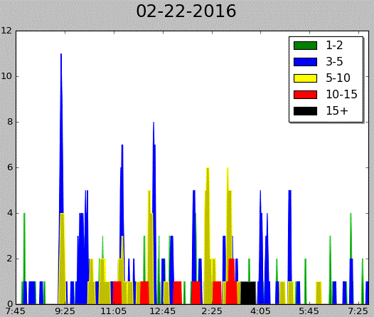
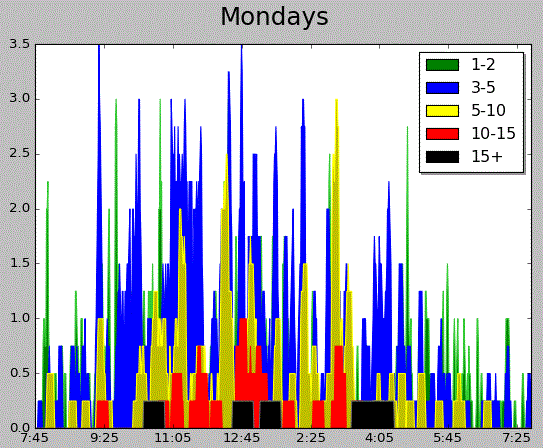
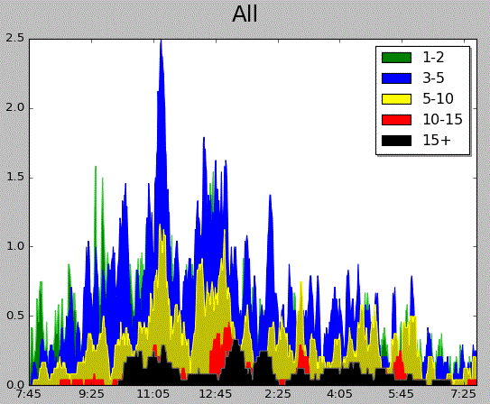
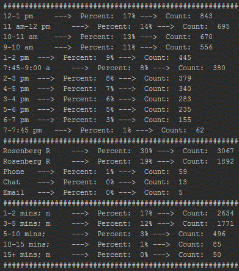

# CCSF Library statistics

Statistics and visualization for City College of San Francisco's reference desk.

## Usage
Run `ref_stats.py` from the command line with the path to your csv file as an argument.

`python stats.csv`

  This will create a vizualization of the data as well as create some statistics on the command line.

__Options:__
Modify the `DAYS` global variable to specify the date range and number of charts to be built.
One chart is built for each entry, passed in as an array.

Valid inputs are dates: `"02-22-2016"`, day names (_shows stats for all instances of that day, in this case all Mondays_): `"mondays"` and all: `"all"`
_ex)_ `DAYS = ["all", "mondays", "02-22-2016"]`

## Contributing
1. Fork it!
2. Create your feature branch: `git checkout -b my-new-feature`
3. Commit your changes: `git commit -am 'Add some feature'`
4. Push to the branch: `git push origin my-new-feature`
5. Submit a pull request

## Credits
Thanks to @scoofy for the help creating the area charts and time axis.
